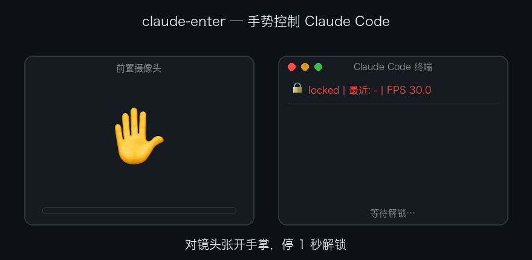

# claude-enter

用 Mac 前置摄像头手势控制终端里的 Claude Code：



| 手势 | 按键 |
|---|---|
| 向上/下/左/右挥手 | ↑ ↓ ← → |
| 握拳保持 0.4 秒 | Enter |

防误触：默认锁定，对镜头**张开手掌停 1 秒**解锁；手离开画面 3 秒自动回锁。

## 安装

```bash
python3.12 -m venv .venv
.venv/bin/pip install -r requirements.txt
.venv/bin/pip install -e .   # 生成 claude-enter 命令，任意目录可用
```

核心识别依赖（mediapipe、opencv-python）是精确锁定的——mediapipe 0.10.3x 移除了本项目使用的 legacy solutions API，不要随意升级。

## 权限（首次运行前）

1. **辅助功能**（注入按键必需）：系统设置 → 隐私与安全性 → 辅助功能，添加并勾选你的终端应用（Terminal/iTerm/VS Code），然后重启终端。
2. **摄像头**：首次运行时系统会弹窗，点允许。

## 使用

```bash
.venv/bin/claude-enter            # 任意目录可用；项目目录内也可用 .venv/bin/python -m claude_enter
```

启动后**点击聚焦运行 Claude Code 的终端窗口**（按键发给当前聚焦窗口；预览窗启动时会抢走焦点，记得点回终端）。

流程：张掌停 1 秒解锁（听到提示音）→ 挥手发方向键、握拳发回车 → 手离开 3 秒自动锁定。

常用选项：

```
--dry-run        只识别不注入按键（调试）
--no-preview     不开预览窗
--no-sound       关提示音
--camera N       摄像头索引（默认 0 = 前置）
--swipe-dist F   swipe 触发位移，画面比例（默认 0.25，越大越不灵敏）
--cooldown F     swipe 冷却秒数（默认 0.6）
--unlock-hold F  张掌解锁秒数（默认 1.0）
--fist-hold F    握拳触发回车秒数（默认 0.4）
```

退出：Ctrl-C 或在预览窗按 q。

## 手动测试清单

1. `--dry-run`：解锁/锁定、四方向挥手、握拳在状态行正确显示，挥手回程不触发反方向
2. 真实注入：聚焦另一终端，确认方向键/回车生效
3. 未授辅助功能权限时启动：打印设置指引并退出（`--dry-run` 可绕过）
4. 摄像头被占用/未授权时启动：打印指引并退出

## 开发

```bash
.venv/bin/pytest -v   # 手势逻辑与状态机单元测试
```
